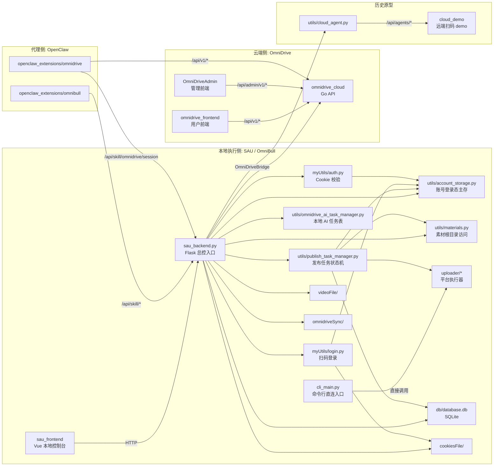
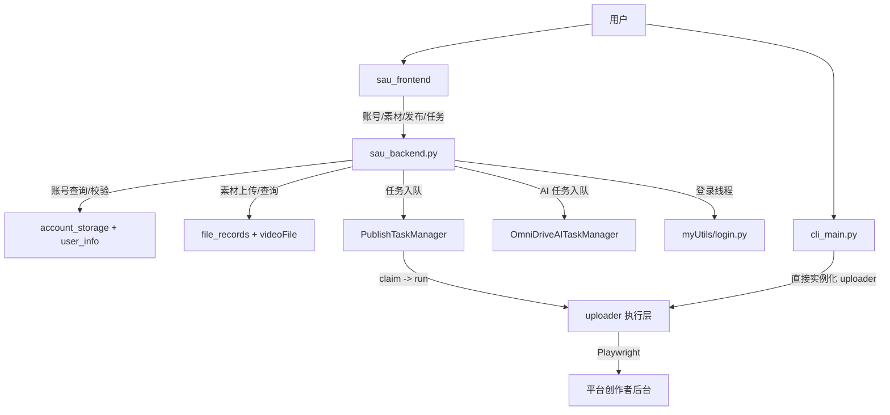
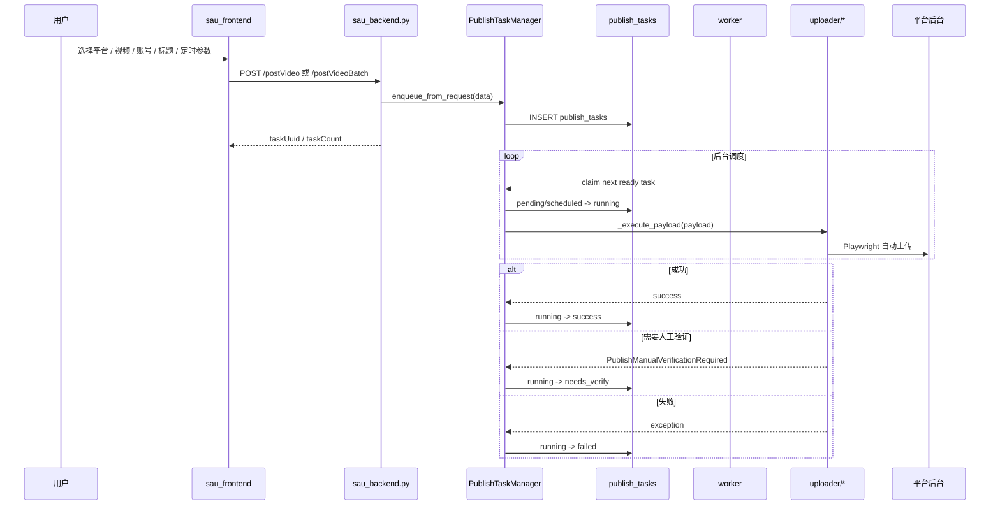
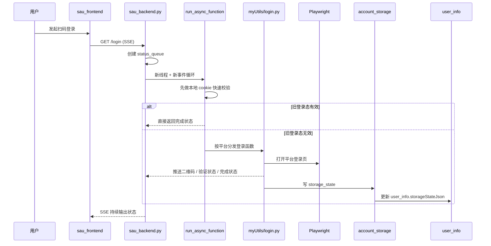
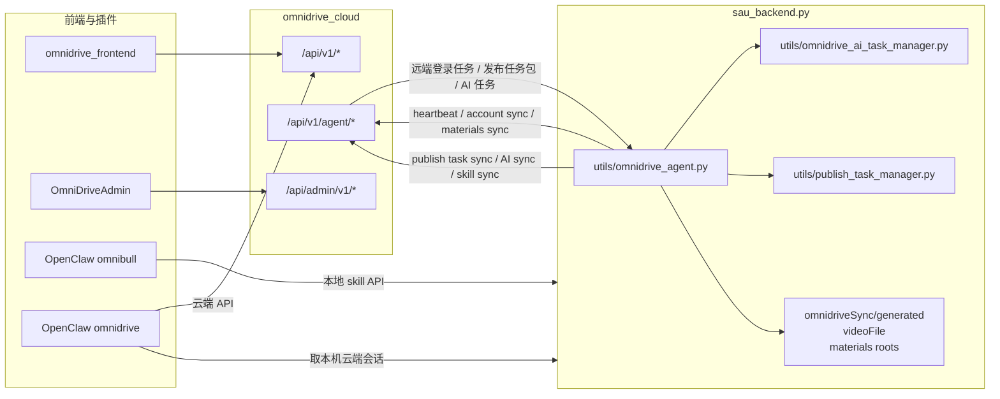
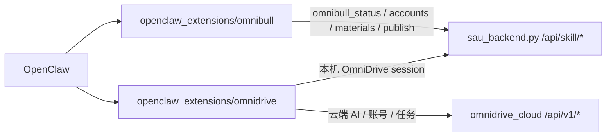
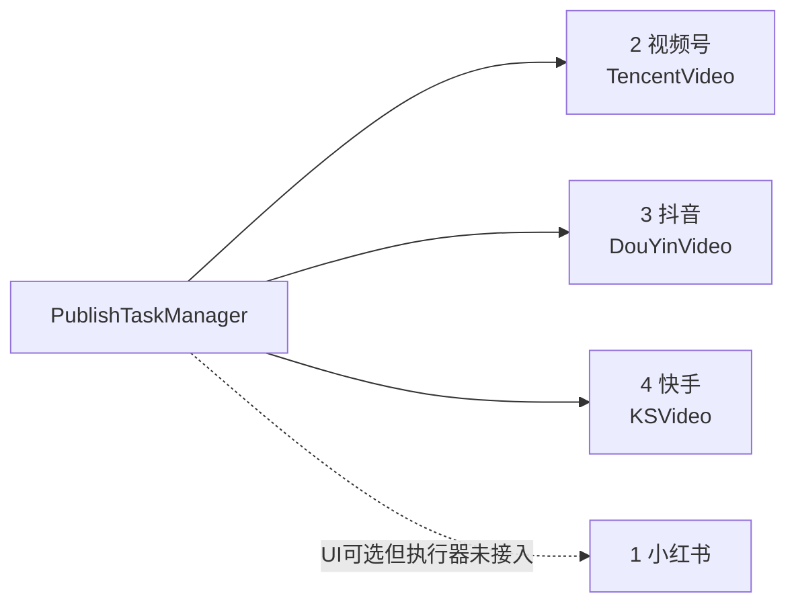
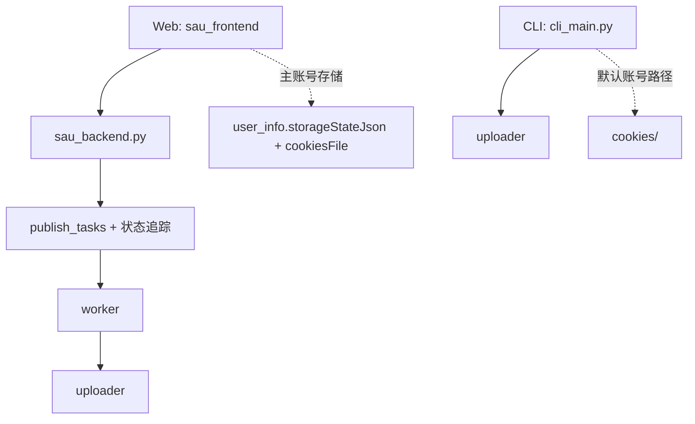
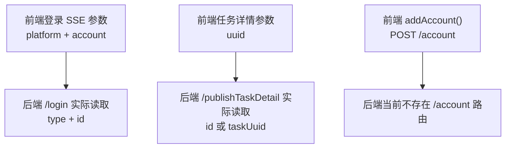

# Current Engineering Graphs

这份文档只描述“当前代码现状”，不描述理想架构。

目标：

- 用图确认仓库里哪些模块是真正活跃的
- 说明本地 `SAU / OmniBull` 主链怎么跑
- 说明 `OmniDrive`、`OpenClaw`、`cloud_demo` 分别怎么接进来
- 标出当前已经确认的边界和漂移点

## 1. 仓库级模块关系图

## 2. 本地 SAU 主链

## 3. 本地发布数据流

## 4. 本地登录数据流

## 5. OmniDrive 与本地执行器关系图

## 6. OpenClaw 调用面

## 7. 当前已确认边界

### 7.1 当前真正接入统一发布队列的平台

### 7.2 Web 与 CLI 不是同一条链

### 7.3 已确认的前后端契约漂移

## 8. 结论

当前最值得作为后续开发基线的理解是：

> 仓库的真实核心不是某个前端页面，而是 `sau_backend.py` 这个本地总控，加上 `PublishTaskManager`、`account_storage`、`uploader/*` 这条执行链。

同时，`OmniDrive` 已经不是旁路原型，而是通过 `utils/omnidrive_agent.py` 深度接入了本地账号、素材、AI 和发布任务。
