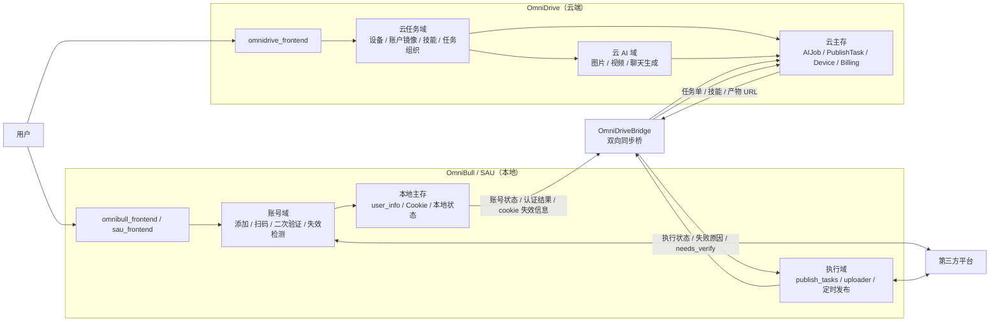
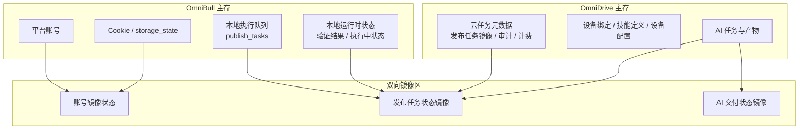
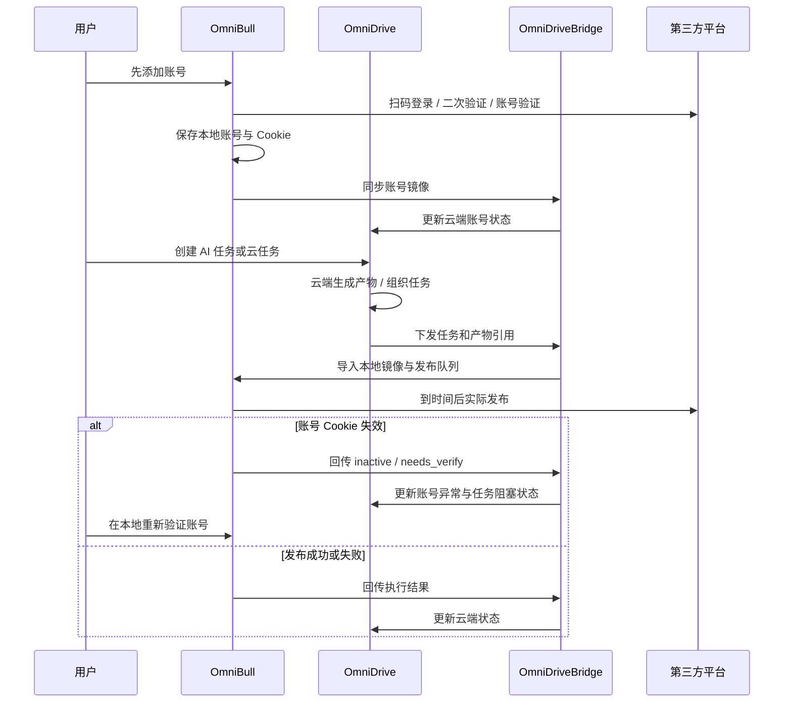
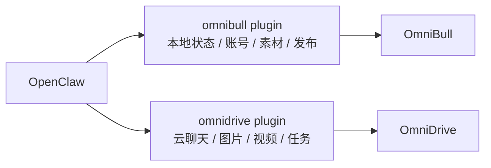
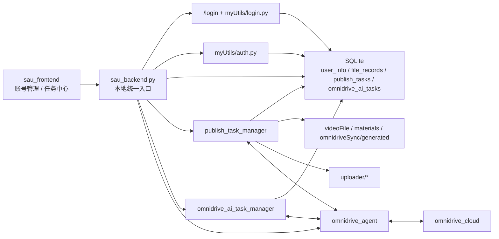
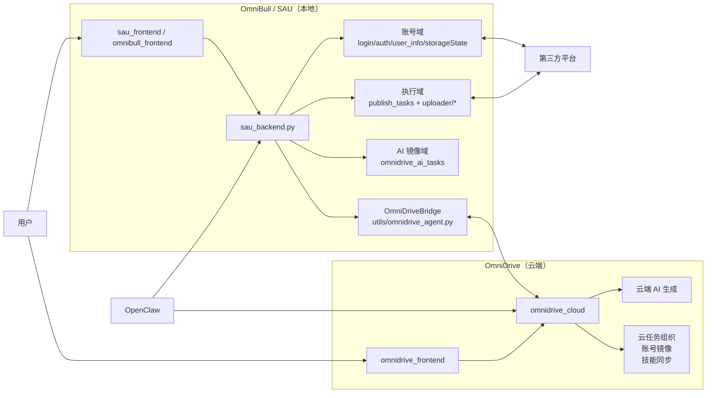
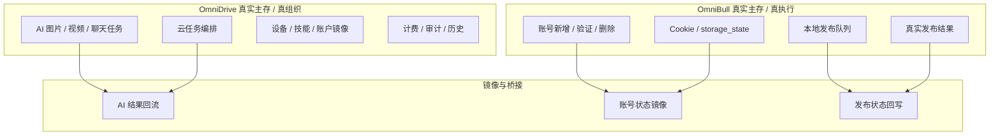
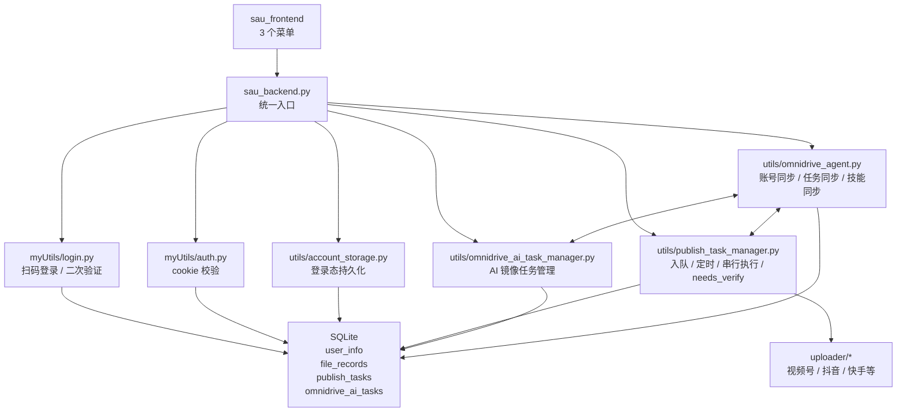
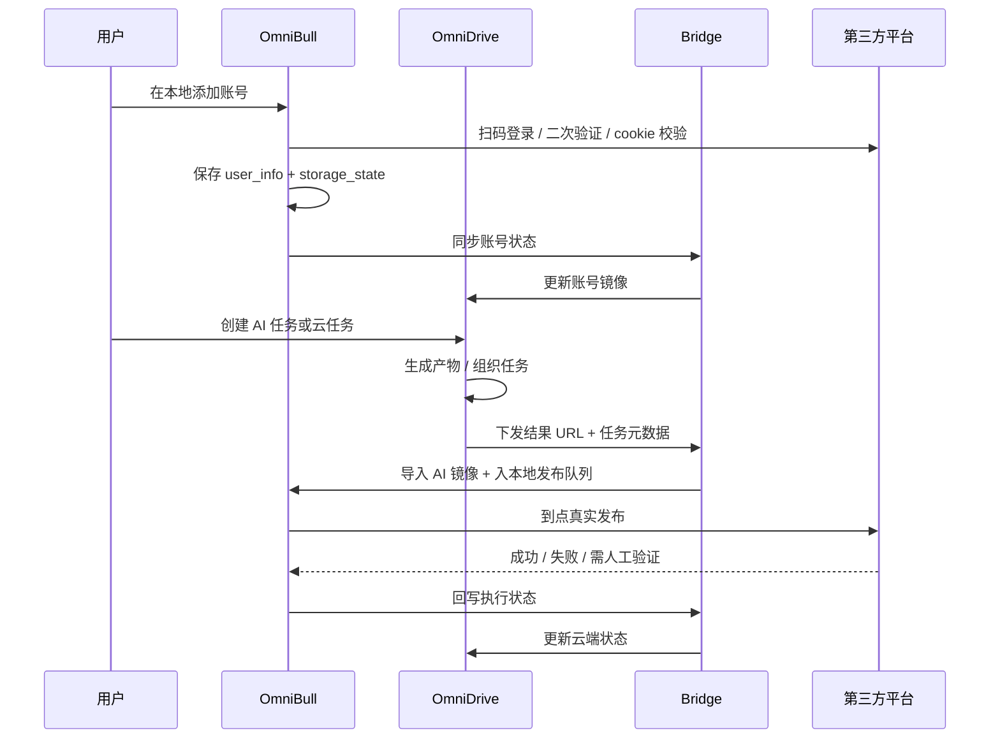

# social-auto-upload 工程模块关系梳理

> 目的：为后续业务实现建立统一理解，避免继续把 `OmniDrive` 和 `OmniBull` 误读成单向前后置关系。  
> 理解优先级：`AlTask.md` 末尾的手写“逻辑调整（工程级）”优先级最高。  
> 当前原则：如果产品蓝图与代码现状冲突，先记录冲突，不先改代码。

## 代码的后端大模型文档
API文档地址：https://docs.apiyi.com/
OpenAI格式文档地址：https://docs.apiyi.com/api-capabilities/openai-sdk
gemini格式地址：https://docs.apiyi.com/api-capabilities/gemini-native-format
Veo视频官方文档：https://docs.apiyi.com/api-capabilities/veo/overview
Nano Banana图片官方文档：https://docs.apiyi.com/api-capabilities/nano-banana-image
Nano Banana图片编辑官方文档：https://docs.apiyi.com/api-capabilities/nano-banana-image-edit

## 0. 一句话结论

这个仓库不是一个单体项目，而是一组围绕同一业务协作的子工程：

- `OmniBull` 负责本地账号管理、账号验证、定时执行、实际推送到第三方平台。
- `OmniDrive` 负责云端 AI 生成、任务组织、设备/技能/账户镜像与结果汇总。
- 两者是并行协作关系，不是“先 OmniDrive 后 OmniBull”或者“先 OmniBull 后 OmniDrive”的简单主从。
- 用户侧真实使用顺序是：
  1. 先在 `OmniBull` 添加并验证账号。
  2. 再在 `OmniDrive` 创建 AI 任务或云端任务。
  3. 到时间后由 `OmniBull` 拉取结果并实际发布。

## 1. 全局职责边界

### 1.1 领域主责

| 领域 | 主责任方 | 辅助方 | 当前代码落点 |
| --- | --- | --- | --- |
| 四个平台账号添加/验证/删除 | `OmniBull` | `OmniDrive` 仅做镜像和状态展示 | `sau_frontend`、`sau_backend.py`、`myUtils/login.py`、`myUtils/auth.py` |
| Cookie/登录态真实持有 | `OmniBull` | `OmniDrive` 不应成为 Cookie 权威源 | `db/database.db:user_info`、`utils/account_storage.py` |
| AI 图片/视频/聊天生成 | `OmniDrive` | `OmniBull` 只承接结果 | `omnidrive_cloud`、`omnidrive_frontend` |
| 云端任务组织与分发 | `OmniDrive` | `OmniBull` 接收并执行 | `omnidrive_cloud/internal/http/handlers/ai.go`、`tasks.go`、`agent.go` |
| 本地发布执行 | `OmniBull` | `OmniDrive` 接收执行状态 | `utils/publish_task_manager.py`、`uploader/*` |
| 设备绑定、心跳、技能配置 | `OmniDrive` | `OmniBull` 定时心跳并拉取缓存 | `utils/omnidrive_agent.py`、`omnidrive_cloud/internal/http/handlers/agent.go` |
| OpenClaw 本地操作 | `OmniBull` 插件 | `OmniDrive` 插件提供云 AI 和聊天 | `openclaw_extensions/omnibull`、`openclaw_extensions/omnidrive` |

### 1.2 必须牢记的口径

- `OmniBull` 不是单纯“执行器”，它还是四个平台账号域的真实入口。
- `OmniDrive` 不是单纯“前台面板”，它还是 AI 产物和云任务的真实组织中心。
- `OpenClaw` 不是业务主存，它只是消费这两个系统能力的 Agent 入口。
- `OmniDriveAdmin` 当前不是本期主线，先不作为业务实现中心。

### 1.3 当前演示账号与 43 服务器口径

- `OmniDrive` 开发演示账号固定为：
  - 手机号：`18812345678`
  - 名称：`禾硕AI`
  - 密码：`123456`
- 该账号的图片历史、视频历史、发布任务、登录链路演示数据，需要落到 `OmniDrive` 自己的数据库，而不是停留在前端 mock。
- 平台账号依然遵循主责边界：
  - `OmniBull` / agent 负责真实账号域和镜像同步
  - `OmniDrive` 保存的是镜像状态，不是 Cookie 主存
- 43 服务器同步演示数据时，不复制本地数据库文件。
  - 正确方式是先同步代码，再在 43 服务器上执行同一套 demo seed
  - 43 服务器信息见：`root@43.98.251.225`
  - 相关脚本：
    - `scripts/cloud_live_sync.py --once --seed-demo-data`
    - `scripts/run_remote_omnidrive_demo_seed.sh`

## 2. 子工程地图

### 2.1 本地侧：OmniBull / SAU

- `sau_frontend`
  - 当前本地用户前端。
  - 已收敛为三个菜单：仪表盘、账号管理、任务中心。
- `omnibull_frontend`
  - 指向 `sau_frontend` 的别名入口。
- `sau_backend.py`
  - 本地总后端入口。
  - 不只是旧 SAU 上传 API，还承担账号管理、登录 SSE、发布任务、AI 任务镜像、OmniDrive 同步、OpenClaw skill API。
- `myUtils/*`
  - 本地扫码登录、Cookie 校验、认证细节。
- `uploader/*`
  - 具体第三方平台自动化执行器。
- `utils/publish_task_manager.py`
  - 本地发布队列和串行执行器。
- `utils/omnidrive_agent.py`
  - 本地到云端的同步桥。
- `utils/omnidrive_ai_task_manager.py`
  - 本地 AI 任务镜像表管理器。

### 2.2 云端侧：OmniDrive

- `omnidrive_frontend`
  - 云端客户控制台。
  - 负责 AI 创建、任务查看、设备查看、账户镜像查看、账单等。
- `omnidrive_cloud`
  - 云端后端。
  - 负责用户、设备、账户镜像、技能、AI 任务、发布任务、审计、计费。

### 2.3 Agent 侧：OpenClaw

- `openclaw_extensions/omnibull`
  - 暴露本地状态、账号、素材、发布能力。
- `openclaw_extensions/omnidrive`
  - 暴露 OmniDrive 登录、模型、聊天、图片、视频、任务能力。

## 3. 产品级关系图

### 3.1 双中心职责图

### 3.2 主存归属图

### 3.3 用户主流程图

### 3.4 OpenClaw 能力入口图

## 4. 本地 OmniBull 的模块关系

### 4.1 本地真实执行链图

### 4.2 本地后端分层

- 入口层：`sau_backend.py`
  - 提供账号、素材、发布任务、AI 任务、登录 SSE、skill API、OmniDrive 桥接入口。
- 登录与账号层：`myUtils/login.py`、`myUtils/auth.py`、`utils/account_storage.py`
  - 管理扫码登录、二次验证、Cookie 持久化、状态校验。
- 发布执行层：`utils/publish_task_manager.py`、`uploader/*`
  - 本地实际发布队列与执行器。
- 云桥接层：`utils/omnidrive_agent.py`
  - 账号同步、素材同步、技能缓存、任务同步、AI 回流、登录会话桥接。
- AI 镜像层：`utils/omnidrive_ai_task_manager.py`
  - 维护本地 `omnidrive_ai_tasks` 表。

## 5. 关键数据流

### 5.1 账号流

主逻辑：

- 用户在 `OmniBull` 发起账号添加。
- 本地 Playwright 登录成功后，把登录态写入本地 `user_info`。
- `OmniDriveBridge` 把平台、账号名、状态、最近认证时间同步到云端。
- 云端保存的是账号镜像，不应成为 Cookie 主存。

当前代码证据：

- 本地登录入口：`sau_backend.py:/login`
- 本地账号同步：`utils/omnidrive_agent.py:_sync_accounts`
- 云端镜像入口：`omnidrive_cloud/internal/http/handlers/agent.go:SyncAccount`

### 5.2 AI 任务流

主逻辑：

- 用户在 `OmniDrive` 创建图片、视频、聊天类任务。
- 云端创建 `AIJob` 并负责执行。
- 产物完成后，桥接到 `OmniBull` 本地。
- 本地只导入结果、入队发布，不负责生成。

当前代码证据：

- 本地 AI 镜像：`utils/omnidrive_ai_task_manager.py`
- 本地 AI 回流：`utils/omnidrive_agent.py:_import_remote_ai_jobs`
- 云端 AI 创建：`omnidrive_cloud/internal/http/handlers/ai.go`
- Agent AI 同步：`omnidrive_cloud/internal/http/handlers/agent.go:SyncAIJob`

### 5.3 发布任务流

主逻辑：

- 发布动作最终必须落到 `OmniBull` 本地队列。
- 本地队列负责时间控制、Cookie 检查、串行执行、失败回写。
- 云端负责保存发布任务镜像和状态汇总。

当前代码证据：

- 本地队列表：`db/database.db:publish_tasks`
- 本地执行器：`utils/publish_task_manager.py`
- 云端下发任务：`utils/omnidrive_agent.py:_import_remote_publish_tasks`
- 云端回写任务：`utils/omnidrive_agent.py:_sync_local_publish_tasks`

### 5.4 技能流

主逻辑：

- 技能的配置权在 `OmniDrive`。
- `OmniBull` 本地通过桥接缓存技能包到 `omnidriveSync/skills/`。
- 本地发布或 AI 产物任务可绑定技能。

当前代码证据：

- 本地技能拉取：`utils/omnidrive_agent.py:_sync_skills`
- 云端技能包接口：`omnidrive_cloud/internal/http/handlers/agent.go:ListSkills`

## 6. 当前代码与产品蓝图的关系

### 6.1 已经对齐的部分

- `sau_frontend` 菜单已收敛为三个入口，符合 `OmniBull` 新定位。
- `omnidrive_frontend` 的“增加账号”弹窗已经改成“去本地 `localhost:5409` 添加并同步”的指引，不再直接在云端做正常新增入口。
- `utils/omnidrive_agent.py` 已经承担真正的双向桥接职责，而不是只做单向同步。

### 6.2 仍然处于过渡态的部分

- 云端仍保留“远程登录会话 / 重新验证”链路。
  - 代码落点：`omnidrive_cloud/internal/http/handlers/accounts.go`
  - 这应理解为兼容层，不应误判成最终产品口径。
- 本地后端仍保留 `/remoteLogin` 和云端登录事件桥。
  - 代码落点：`sau_backend.py:/remoteLogin`
  - 同样属于过渡兼容逻辑。
- 新发布编排当前真正支持的平台只有：
  - `2 = 视频号`
  - `3 = 抖音`
  - `4 = 快手`
  - `小红书` 虽然在产品主轴中属于四平台重点，但当前新队列执行器还没有接入。
- 本地前端和本地后端接口仍存在错位，说明前端仍是过渡态。

## 7. 后续实现时必须遵守的红线

- 不要把 `OmniDrive` 改成 Cookie 权威源。
- 不要把 `OmniBull` 改成 AI 生成中心。
- 账号域的新增、认证、失效检测，优先落在 `OmniBull`。
- AI 产物的生成、计费、归档，优先落在 `OmniDrive`。
- 任务最终执行状态必须由 `OmniBull` 回写，不能在云端假设执行成功。
- 任何同步接口都要按“幂等 + 可重试 + 可恢复”设计，因为当前桥接层就是按这个模型运行的。

## 8. 面向后续开发的推荐心智模型

后续开发时，建议始终用下面这套模型思考：

- `OmniBull = 本地账号中心 + 本地执行中心`
- `OmniDrive = 云端 AI 中心 + 云端任务中心`
- `OmniDriveBridge = 数据同步和状态协调中心`
- `OpenClaw = 调用这些能力的 Agent 入口`

如果某个新需求同时涉及账号、AI、发布、设备四个域，优先先问四个问题：

1. 这个数据的真实主存应该在哪边？
2. 这个动作是谁真正执行的？
3. 另一边拿到的是主数据还是镜像？
4. 同步失败后，应该由哪边重试和兜底？

先把这四个问题答对，后面的代码实现才不会继续跑偏。

## 9. 线程速查图

下面这组图是给后续线程快速查阅用的“简化版工程理解”，默认以 `AlTask.md` 末尾“逻辑调整（工程级）”为最高优先级。

### 9.1 总体协作图

### 9.2 主责边界图

### 9.3 本地主链图

### 9.4 用户真实流程图

## 10. 基础信息

- 云端服务器是：43.98.251.225，账户 `root/xhSL.1379`。
- 前端域名：`aitoplus.com`，体验账户：`18888888888/123456`。
- 管理端：`ad.aitoplus.com`，账户 `admin/123456`。
- 管理端 web 位于：`/www/wwwroot/omnidrive_admin`
- 前端 web 位于：`/www/wwwroot/aitoplus.com`
- Go 代码位于：`/www/wwwroot/OmniDriveCloud`
- 编译的 bin 位于：`/www/wwwroot/OmniDriveCloud/bin`
- pgsql数据库:用户名和数据库都是omnidrive，密码是KRGkXp7ckx4P7abh
