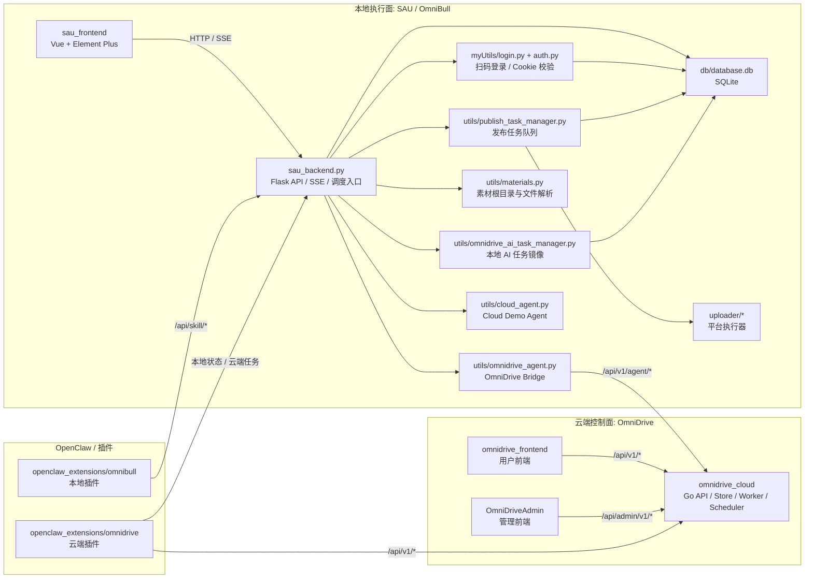
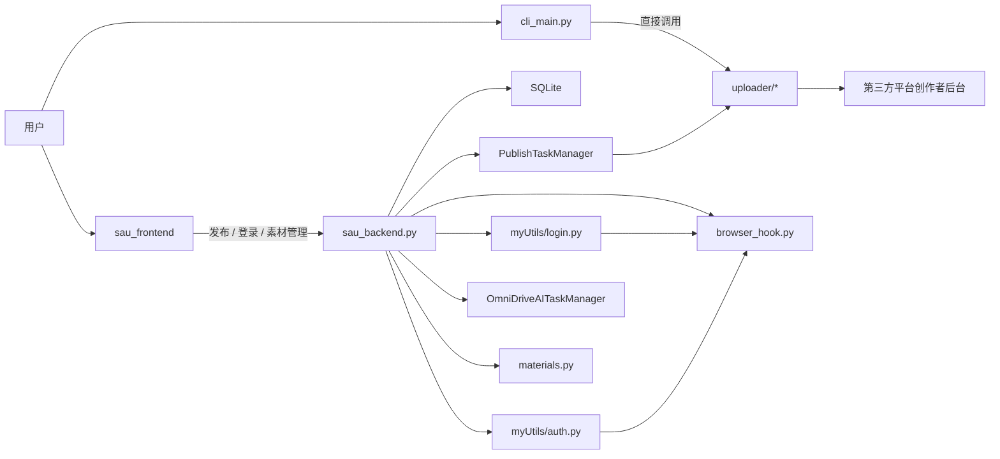
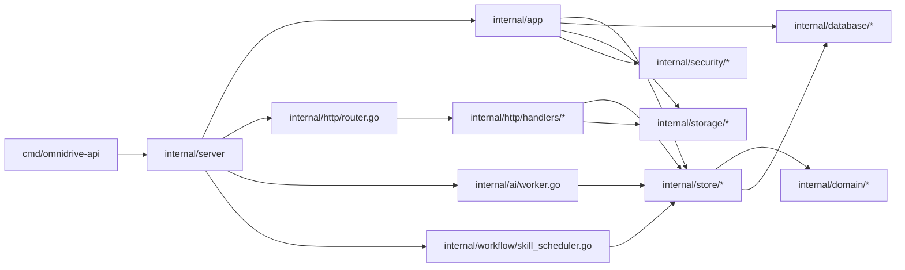
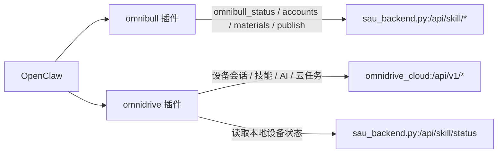

# Engineering Readiness Baseline

生成时间：2026-03-18（Asia/Shanghai）

这份文档的目标不是重复 README，而是给后续开发一个“已经按代码核实过”的接手基线：

- 仓库里到底有几套系统
- 哪些目录是现行主链路
- 模块之间的真实调用关系
- 当前已经确认的接口漂移、测试状态和运行风险

如果你只想先看已有的结构说明，也可以搭配下面两份文档一起读：

- `docs/project_structure.md`
- `docs/module_relationships.md`

## 1. 当前仓库的真实形态

当前仓库已经不是单一的 Flask + Vue 项目，而是一个多工程仓库，至少包含 4 组活跃模块：

1. `SAU / OmniBull` 本地执行器
   - `sau_backend.py`
   - `sau_frontend`
   - `uploader`
   - `myUtils`
   - `utils`
   - `db`
2. `OmniDrive` 云端控制面
   - `omnidrive_cloud`
   - `omnidrive_frontend`
3. `OmniDrive` 管理后台
   - `OmniDriveAdmin`
4. `OpenClaw` 集成面
   - `openclaw_extensions/omnibull`
   - `openclaw_extensions/omnidrive`

此外还有两类辅助目录：

- 历史/原型目录：`cloud_demo`
- 工程快捷入口：`projects`

结论：后续工作必须先明确自己是在改“本地执行器”“云端控制面”“管理后台”还是“OpenClaw 插件”，不能把它们当成同一进程下的模块。

## 2. 仓库级模块关系图

## 3. 现行主链路

### 3.1 SAU / OmniBull 本地执行链路

### 3.2 OmniDrive 云端分层关系

### 3.3 OpenClaw 接入关系

## 4. 关键入口与职责

| 模块 | 入口 | 职责 | 当前判断 |
| --- | --- | --- | --- |
| 本地后端 | `sau_backend.py` | Flask API、SSE 登录、任务入队、技能 API、Agent 启动 | 现行主入口 |
| 本地前端 | `sau_frontend/src` | 账号、素材、发布、系统状态页面 | 现行前端，但有接口漂移 |
| CLI | `cli_main.py` | 本地直接登录/上传 | 可用，但与 Web 不完全同链路 |
| 平台执行器 | `uploader/*` | Playwright 自动登录和发布 | 真实执行层 |
| 本地任务调度 | `utils/publish_task_manager.py` | 任务入库、worker 执行、状态同步、验证截图 | 现行主链路 |
| 本地云桥接 | `utils/omnidrive_agent.py` | 账号/素材/技能/任务同步，拉取云任务 | 现行主链路 |
| 云端后端 | `omnidrive_cloud/cmd/omnidrive-api` | 用户 API、Agent API、Admin API | 现行主链路 |
| 用户云前端 | `omnidrive_frontend/app` | 云端用户控制台 | 现行前端 |
| 管理前端 | `OmniDriveAdmin/app` | 运营/管理后台 | 现行前端 |
| OpenClaw 本地插件 | `openclaw_extensions/omnibull` | 暴露本地账号/素材/发布能力 | 现行主链路 |
| OpenClaw 云插件 | `openclaw_extensions/omnidrive` | 暴露云端技能/AI/任务能力 | 现行主链路 |

## 5. 代码级核实后的事实

### 5.1 发布任务统一调度器并没有覆盖仓库中所有平台

`uploader` 目录中可见的平台实现包括：

- 抖音
- 视频号
- 快手
- 小红书
- TikTok
- Bilibili
- 百家号

但 `utils/publish_task_manager.py` 里当前只明确分发：

- `2` 视频号
- `3` 抖音
- `4` 快手

因此后续讨论“支持哪些平台”时，必须区分三种状态：

1. 目录存在
2. CLI 可直调
3. 已接入统一发布队列

### 5.2 Web 与 CLI 不是同一条资产链路

- Web 登录与账号管理主链路使用 `cookiesFile`
- CLI 默认拼 `BASE_DIR / cookies / <platform>_<account>.json`

这意味着 CLI 与 Web 的 Cookie 资产目前不是天然共享的。

### 5.3 `sau_backend.py` 已经是明显的单文件总控

已混合职责包括：

- 静态文件服务
- 素材上传/删除
- 账号查询/验证/删除
- SSE 登录
- 远端扫码桥接
- 发布任务 API
- AI 任务 API
- Skill API
- Cloud Agent / OmniDrive Agent 启动
- 请求日志与 CORS

后续如果要继续迭代 Flask 侧，优先拆分蓝图或 service 层会比继续堆单文件更稳。

## 6. 基础验证结果

| 检查项 | 命令 | 结果 | 备注 |
| --- | --- | --- | --- |
| Python 语法编译 | `python3 -m py_compile sau_backend.py cli_main.py myUtils/*.py utils/*.py uploader/*/*.py db/createTable.py` | 通过 | 说明 Python 主链路至少没有语法错误 |
| 本地桥接单测 | `python3 -m unittest tests/test_omnidrive_agent.py` | 通过 | 先修正了测试夹具未传 `run_login_fn` 的问题 |
| Go 云端单测 | `cd omnidrive_cloud && go test ./...` | 通过 | `internal/ai`、`internal/store`、`internal/http/middleware` 已覆盖部分测试 |
| 本地前端构建 | `cd sau_frontend && npm run build` | 通过 | Vite 有 `NODE_ENV` 提示，但不影响构建成功 |
| 依赖文件探测 | `file requirements.txt` | 风险项 | 文件是 `UTF-16 LE + CRLF`，对部分脚本/工具不友好 |

## 7. 当前已确认的接口漂移与风险

### 7.1 本地前端与后端接口存在真实漂移

| 漂移点 | 前端位置 | 后端位置 | 影响 |
| --- | --- | --- | --- |
| 登录 SSE 参数名不一致 | `sau_frontend/src/api/account.js` 使用 `platform`/`account` | `sau_backend.py:/login` 读取 `type`/`id` | 前端扫码登录无法按当前后端契约启动 |
| 登录平台值不一致 | `AccountManagement.vue` 传 `douyin` / `kuaishou` / `shipinhao` / `xiaohongshu` | `run_async_function()` 只认 `'1'..'4'` | 就算参数名修正，平台值也仍需映射 |
| 下载 Cookie 参数不一致 | `account.js` / `AccountManagement.vue` 按 `id` 拼接 | `/downloadCookie` 读取 `filePath` | 下载 Cookie 会失败 |
| 添加账号 API 不存在 | `accountApi.addAccount()` 调 `/account` | 后端没有 `/account` 路由 | 该接口是死链 |
| 发布任务详情参数不一致 | `publishApi.getPublishTaskDetail()` 传 `uuid` | `/publishTaskDetail` 读取 `id` 或 `taskUuid` | 详情查询会失败 |
| AI 任务详情参数不一致 | `systemApi.getAITaskDetail()` 传 `uuid` | `/aiTaskDetail` 读取 `taskUuid` 或 `id` | 详情查询会失败 |
| 素材删除方法名不一致 | `MaterialManagement.vue` 调 `materialApi.deleteFile()` | `materialApi` 只导出 `deleteMaterial()` | 页面运行时直接报错 |
| 系统状态数据结构不一致 | `SystemStatus.vue` 读取 `data.connected` 和纯字符串根目录 | `/cloudAgentStatus`、`/omnidriveAgentStatus`、`/api/skill/status` 返回的是嵌套对象与根目录对象数组 | 页面显示会失真或空白 |

### 7.2 CLI 还有一个未实现动作

`utils/base_social_media.py` 暴露了 `watch` 动作，但 `cli_main.py` 只实现了：

- `login`
- `upload`

`watch` 目前只是 parser 层可见，没有实际执行分支。

### 7.3 运行环境层面还有两个要注意的点

1. 当前工作树不是干净状态
   - `OmniDriveAdmin/*`
   - `omnidrive_cloud/internal/*`
   - `utils/omnidrive_ai_task_manager.py`
   - 以及新出现的 `omnidrive_cloud/internal/workflow/`

2. `sau_backend.py` 会在请求期和模块初始化阶段尝试启动后台服务
   - `PublishTaskManager`
   - `OmniDriveAITaskManager`
   - `CloudAgent`
   - `OmniDriveBridge`

后续做局部调试时，要先确认是否希望这些后台线程自动起来。

## 8. 建议的后续进入顺序

建议不要一上来就跨 SAU、OmniDrive、OpenClaw 三条线同时改。更稳的顺序是：

1. 先把 `sau_frontend <-> sau_backend.py` 的接口契约对齐
   - 先修登录、任务详情、Cookie 下载、素材删除、系统状态这几处漂移
2. 再明确本地统一发布队列的真实支持范围
   - 哪些平台已经能被 `PublishTaskManager` 稳定调度
   - 哪些仍然只有 CLI/示例级能力
3. 之后再进入 `OmniDriveBridge <-> omnidrive_cloud` 的联调
   - 这条链路当前的基础测试和 Go 单测已经能提供一些保护
4. 最后再处理管理台与云前端
   - 它们依赖的是更稳定的云端 API，而不是本地 Flask 细节

## 9. 这次巡检带来的直接产物

本次检查额外做了两件有利于后续开发的准备工作：

1. 修正了 `tests/test_omnidrive_agent.py` 的测试夹具参数，使当前单测可运行
2. 把本仓库的“多工程边界 + 模块关系 + 风险点”收敛成这份文档，后续可以直接作为接手基线
