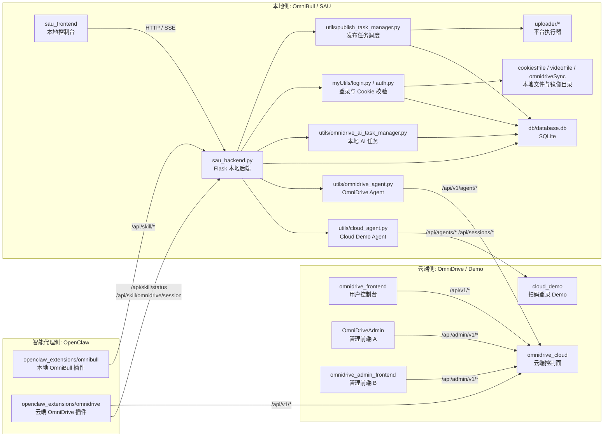
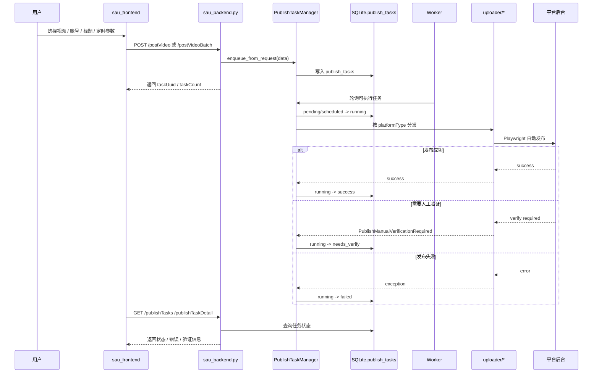
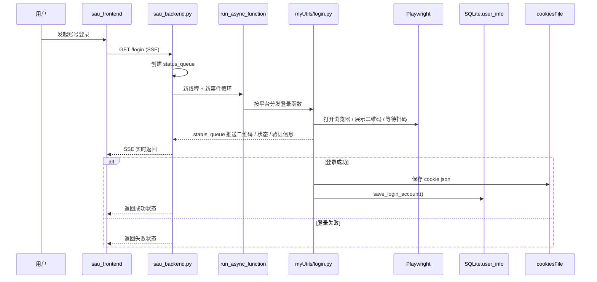
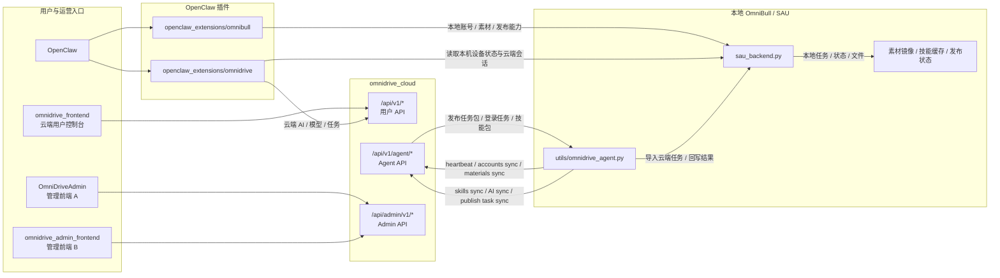

# Module Relationships

这份文档关注的是“仓库里各个大模块之间的关系”，不是单独某一个子工程的内部实现。

目标是把下面几件事讲清楚：

- 哪些目录是真正的大模块
- 谁调用谁
- 哪些是现行主链路
- 哪些只是并行前端 / 历史原型 / 工程别名

## 可视化总览

### 1. 仓库级模块关系图



### 2. 本地发布业务流



### 3. 本地登录业务流



### 4. 云端、Agent、OpenClaw 数据流



## 1. 大模块清单

| 模块 | 目录 / 入口 | 角色 | 当前判断 |
| --- | --- | --- | --- |
| SAU / OmniBull 本地执行器 | `sau_backend.py` `sau_frontend` `uploader` `myUtils` `utils` `db` | 本地账号、素材、发布、登录、任务调度执行 | 现行主链路 |
| OmniDrive Cloud | `omnidrive_cloud` | 云端控制面，统一提供用户 API、Agent API、Admin API | 现行主链路 |
| OmniDrive 用户前端 | `omnidrive_frontend` | 云端用户控制台 | 现行主链路，但默认带 mock fallback |
| OmniDrive 管理前端 A | `OmniDriveAdmin` | 云端管理后台 | 并行前端 |
| OmniDrive 管理前端 B | `omnidrive_admin_frontend` | 云端管理后台另一套实现 | 并行前端 |
| OpenClaw -> OmniBull 插件 | `openclaw_extensions/omnibull` | 让 OpenClaw 调本地 OmniBull / SAU | 现行主链路 |
| OpenClaw -> OmniDrive 插件 | `openclaw_extensions/omnidrive` | 让 OpenClaw 调云端 OmniDrive AI | 现行主链路 |
| Cloud QR Demo | `cloud_demo` | 早期远端扫码登录 demo | 历史原型，但本地仍保留兼容代码 |
| 工程快捷入口 | `projects` | 活跃工程软链接入口 | 辅助目录，不是业务模块 |
| 文档占位目录 | `sau_backend` | 旧说明文档目录 | 不是实际后端工程 |

## 2. 仓库级总关系图

```text
                                   ┌──────────────────────────────┐
                                   │           用户 / 运维         │
                                   └──────────────┬───────────────┘
                                                  │
             ┌────────────────────────────────────┼────────────────────────────────────┐
             │                                    │                                    │
             v                                    v                                    v
  ┌──────────────────────┐             ┌──────────────────────┐             ┌──────────────────────┐
  │ 本地控制台            │             │ 云端控制台            │             │ OpenClaw              │
  │ sau_frontend          │             │ omnidrive_frontend   │             │ 本地智能代理          │
  └──────────┬───────────┘             └──────────┬───────────┘             └──────────┬───────────┘
             │ HTTP / SSE                          │ /api/v1                              │ 插件调用
             v                                     v                                      v
  ┌────────────────────────────────────────────────────────────────────────────────────────────────┐
  │                                    模块关系中枢                                                │
  └──────────────────────┬───────────────────────────────┬────────────────────────────────────────┘
                         │                               │
                         v                               v
         ┌─────────────────────────────┐   ┌───────────────────────────────────────┐
         │ SAU / OmniBull 本地执行器    │   │ OmniDrive Cloud                        │
         │ sau_backend.py + uploader    │   │ omnidrive_cloud                       │
         └──────────────┬──────────────┘   └──────────────┬────────────────────────┘
                        │                                 │
                        │                                 │
          ┌─────────────┼─────────────┐         ┌─────────┼───────────────┬──────────┐
          │             │             │         │         │               │          │
          v             v             v         v         v               v          v
   [SQLite db]   [Playwright]   [任务调度]   [/api/v1] [/api/v1/agent] [/api/admin/v1] [文件存储/对象资产]
      │              │              │          │         │               │
      │              │              │          │         │               │
      │              │              │          │         │               │
      │              │              │          │         │               │
      │              │              │          │         │               │
      │              │              │          │         │               │
      │              │              │          │         │               │
      │              │              │          │         │               │
      │              │              │          │         │               │
      v              v              v          v         v               v
  user_info      登录/校验      publish_tasks  用户前端   本地 OmniBull Agent  管理前端
  file_records   平台发布       AI 本地任务    omnidrive_  utils/omnidrive_     OmniDriveAdmin
  publish_tasks                                 frontend    agent.py            omnidrive_admin_frontend
```

## 3. 现行主链路

### 3.1 本地执行链路

```text
[sau_frontend]
    -> 调本地 Flask API
    -> sau_backend.py
       -> myUtils/login.py
       -> myUtils/auth.py
       -> utils/publish_task_manager.py
       -> utils/omnidrive_ai_task_manager.py
       -> uploader/*
       -> db/database.db
```

这是当前本地最核心的一条线。

### 3.2 云端控制链路

```text
[omnidrive_frontend]
    -> omnidrive_cloud /api/v1/*

[OmniDriveAdmin]
    -> omnidrive_cloud /api/admin/v1/*

[omnidrive_admin_frontend]
    -> omnidrive_cloud /api/admin/v1/*
```

这里有一个很重要的事实：

- `omnidrive_cloud` 不是只给一个前端服务
- 它同时服务 3 类客户端：
  - 用户前端
  - 本地 Agent
  - 管理后台

### 3.3 OpenClaw 集成链路

```text
[openclaw_extensions/omnibull]
    -> 本地 sau_backend.py /api/skill/*

[openclaw_extensions/omnidrive]
    -> 云端 omnidrive_cloud /api/v1/*
    -> 必要时再调本地 sau_backend.py /api/skill/omnidrive/session
```

也就是说：

- `omnibull` 插件偏“本地操作能力”
- `omnidrive` 插件偏“云端 AI 能力”
- `omnidrive` 插件并不是完全脱离本地 OmniBull，它会优先从本地读当前设备的云端会话与设备绑定信息

## 4. 本地执行器内部关系

```text
                    ┌─────────────────────────────┐
                    │      sau_backend.py         │
                    │      本地 Flask 总控        │
                    └──────────┬──────────────────┘
                               │
      ┌────────────────────────┼─────────────────────────┬────────────────────────┐
      │                        │                         │                        │
      v                        v                         v                        v
 [账号登录/校验]         [发布任务调度]             [本地 AI 任务]           [云桥接]
 myUtils/login.py       utils/publish_task_       utils/omnidrive_         utils/cloud_agent.py
 myUtils/auth.py        manager.py                ai_task_manager.py        utils/omnidrive_agent.py
      │                        │                         │                        │
      v                        v                         v                        v
 [cookiesFile/*.json]   [publish_tasks]           [omnidrive_ai_tasks]      [远端云接口]
 [user_info]            [uploader/*]              [同步到 OmniDrive]         [Cloud Demo / OmniDrive]
```

### 这层里要特别注意的关系

- `uploader/*` 才是真正的平台执行层。
- `sau_frontend` 不是执行层，它只是本地控制台。
- `db/database.db` 不是纯存储层，它也承担任务状态机角色。
- `sau_backend.py` 现在同时扮演了：
  - API 层
  - 调度入口
  - 登录桥接层
  - 静态前端服务层
  - 云桥接启动层

## 5. 云端控制面的真实分层

```text
                       ┌──────────────────────────────┐
                       │        omnidrive_cloud       │
                       │        单一云端后端          │
                       └──────────────┬───────────────┘
                                      │
         ┌────────────────────────────┼─────────────────────────────┐
         │                            │                             │
         v                            v                             v
   [用户 API]                    [Agent API]                   [Admin API]
   /api/v1/*                    /api/v1/agent/*               /api/admin/v1/*
         │                            │                             │
         v                            v                             v
  omnidrive_frontend          本地 OmniBull Agent              管理后台前端
                              utils/omnidrive_agent.py         OmniDriveAdmin
                                                               omnidrive_admin_frontend
```

### Agent API 在做什么

`/api/v1/agent/*` 这一组接口，说明云端和本地 OmniBull 之间是“Agent 协议”关系，而不是前端直接远程控制本地浏览器：

- `heartbeat`
- `accounts/sync`
- `materials/*/sync`
- `skills/{deviceCode}`
- `skills/sync`
- `ai-jobs/*`
- `publish-tasks/*`
- `login-tasks/{deviceCode}`

这意味着当前设计是：

- 云端下发任务、同步技能、同步素材
- 本地 OmniBull Agent 轮询并执行
- 执行结果再回写云端

## 6. 两套云桥接不要混淆

仓库里现在其实有两套不同的“云桥接”：

### A. 早期扫码登录 demo 链路

```text
utils/cloud_agent.py
    <-> cloud_demo
        /api/agents/*
        /api/sessions/*
```

这套链路只解决远端扫码登录、设备在线状态、简单账号镜像。

### B. 当前 OmniDrive 云控制链路

```text
utils/omnidrive_agent.py
    <-> omnidrive_cloud
        /api/v1/agent/*
```

这套链路覆盖：

- 设备心跳
- 账号同步
- 素材根目录和文件同步
- 技能同步
- 发布任务同步与领取
- AI 任务同步与回写

所以后续我们讨论“云端能力”时，默认应该优先指 `OmniDrive` 这套，而不是 `cloud_demo`。

## 7. 需要明确标注的并行模块

### 7.1 两个管理前端

仓库里有两套都指向同一类后台接口的管理前端：

- `OmniDriveAdmin`
- `omnidrive_admin_frontend`

它们都面向：

- `omnidrive_cloud /api/admin/v1/*`

所以目前更合理的理解不是“两个不同的后台系统”，而是“两个并行中的管理台前端实现”。

### 7.2 `projects` 不是业务层

`projects` 只是快捷入口，不应该画成业务模块。

### 7.3 `sau_backend/` 不是 Python 后端工程

`sau_backend/` 目录里目前只有 README，它不是和 `sau_backend.py` 并列的后端模块。

## 8. 当前最稳妥的统一理解

如果我们后续继续开发，这里建议统一采用下面这组认知：

### 本地侧

```text
OmniBull = SAU 本地执行器 + OpenClaw 所在设备
```

它包含：

- `sau_backend.py`
- `sau_frontend`
- `uploader`
- `myUtils`
- `utils`
- `db`
- `openclaw_extensions/omnibull`

### 云端侧

```text
OmniDrive = 云端控制面
```

它包含：

- `omnidrive_cloud`
- `omnidrive_frontend`
- 管理前端（`OmniDriveAdmin` / `omnidrive_admin_frontend`）

### 智能代理侧

```text
OpenClaw = 本地智能代理，通过插件同时接本地 OmniBull 和云端 OmniDrive
```

它包含：

- `openclaw_extensions/omnibull`
- `openclaw_extensions/omnidrive`

## 9. 后续开发时最容易出错的地方

- 把 `sau_frontend` 当成“系统真相”，但很多真实能力其实定义在 `sau_backend.py` 和 `utils/*`。
- 把 `cloud_demo` 当成现在的主云端，其实它更像早期 demo。
- 把 `OmniDriveAdmin` 和 `omnidrive_admin_frontend` 当成两个不同后台，其实它们都指向同一类 admin API。
- 把 `projects/` 当成业务层目录，它其实只是入口集合。
- 忽略 `openclaw_extensions/omnidrive` 对本地 OmniBull 的依赖，以为它只连云端。

## 10. 一句话总结

```text
当前仓库的真实结构不是“一个 SAU 项目”，而是：

本地执行器（OmniBull / SAU）
    + 云端控制面（OmniDrive）
    + 本地智能代理插件（OpenClaw extensions）
    + 历史扫码 demo（cloud_demo）

共同组成的一套多工程仓库。
```
