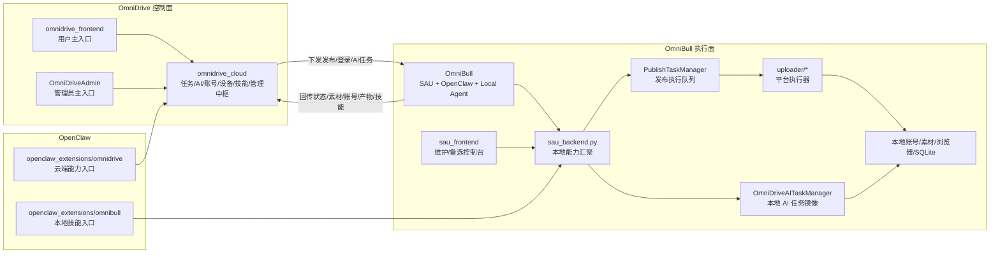
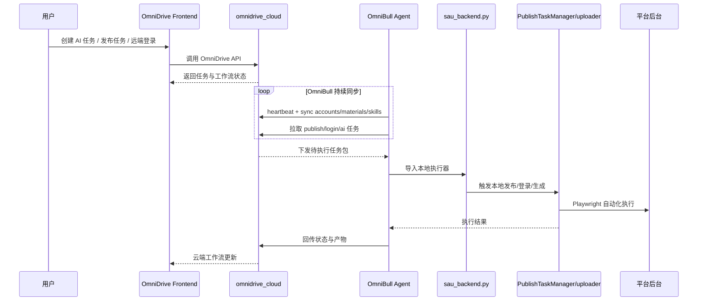

# OmniDrive / OmniBull 架构理解

这份文档用于给后续 AI 和开发者提供统一的系统理解，避免再把本地 `SAU` 视为整个系统的中心。

当前应采用的正确视角是：

- `OmniDrive` 是控制面，也是主要业务入口和事实来源
- `OmniDriveAdmin` 是管理员主入口
- `OmniBull` 是执行面，是本地边缘执行终端
- `sau_frontend` 只是本地维护/备选控制台，不是主产品入口

如果后续规划、改造、拆模块、补接口，请优先遵守这组边界。

## 命名与角色

### 1. OmniDrive

`OmniDrive` 由以下部分组成：

- `omnidrive_cloud`
- `omnidrive_frontend`

它承担的职责是：

- 用户任务入口
- AI 任务入口
- 远端登录入口
- 发布任务编排中心
- 设备绑定与设备状态管理
- 账号、素材、技能的云端视图
- 管理和运营所依赖的系统事实来源

换句话说，后续如果问“系统核心在哪”，答案应是：

- `omnidrive_cloud`

而不是：

- `sau_backend.py`

### 2. OmniDriveAdmin

`OmniDriveAdmin` 是管理员使用的控制台。

管理员主要通过它管理：

- 系统配置
- 设备
- 用户与运营视图
- 平台级管理能力

因此在产品视角上：

- 普通用户主要使用 `omnidrive_frontend`
- 管理员主要使用 `OmniDriveAdmin`

### 3. OmniBull

`OmniBull` 明确指：

- `SAU`
- `OpenClaw`
- 本地 Agent

它是执行终端，不是业务中枢。

它承担的职责是：

- 维持本地浏览器自动化执行能力
- 拉取云端下发的发布/登录/AI 任务
- 调用本地 uploader 和浏览器自动化完成执行
- 把执行结果、产物、状态同步回云端
- 把本地账号、素材、技能等能力同步到云端

### 4. sau_frontend

`sau_frontend` 的定位应理解为：

- 本地维护界面
- 备选入口
- 调试/排障/维护时可用的控制台

不要再把它当成主产品入口或主工作流中心。

## 系统总图

## 主流程图

## 模块分层理解

### 一层：控制面

### `omnidrive_cloud`

这是最重要的系统中枢。后续 AI 在理解全局系统时，应优先从这里建立模型。

它主要负责：

- 用户 API
- AI 工作流
- 发布任务工作流
- 远端登录工作流
- 账号管理
- 设备管理
- Agent 同步接口
- 管理员接口

应把它看成：

- 控制面
- 任务事实源
- 状态事实源

而不是仅仅把它看成“云端适配层”。

### `omnidrive_frontend`

这是普通用户主入口。用户的大部分时间应在这里完成：

- 创建任务
- 查看任务
- 使用 AI 生成
- 选择设备执行
- 观察工作流状态

### `OmniDriveAdmin`

这是管理员主入口。后续涉及运营、管理、设备治理、系统管理时，应默认站在这里的需求视角上理解。

### 二层：执行面

### `utils/omnidrive_agent.py`

这是 `OmniBull` 与 `OmniDrive` 之间最关键的同步桥。

它的职责是：

- 心跳
- 同步本地账号到云端
- 同步本地素材到云端
- 同步本地技能到云端
- 拉取云端发布任务
- 拉取云端远端登录任务
- 拉取云端 AI 任务
- 回传本地执行状态和产物

因此它不是辅助代码，而是边缘执行模型的核心。

### `sau_backend.py`

本地 Flask 服务属于 `OmniBull` 的本地能力汇聚层。

它的职责更适合被定义为：

- 本地能力编排入口
- 本地 uploader 调度入口
- 本地 OpenClaw skill 接口入口
- 本地维护能力暴露面

不要把它理解为全局任务事实来源。

### `PublishTaskManager`

它负责本地发布执行队列和平台执行调度。

在产品角色上，它更接近：

- 本地执行器
- 云端任务的落地执行层

而不是全局任务系统本身。

### `OmniDriveAITaskManager`

它是本地 AI 任务镜像和执行配套层，用于承接云端 AI 工作流在本地侧的映射、产物落地和状态回传。

### `uploader/*`

这里是真正接触平台浏览器自动化的底层执行器。

它们属于：

- 执行实现层
- 平台适配层

不属于系统控制层。

### 三层：辅助和维护入口

### `openclaw_extensions/omnibull`

这是本地能力入口，更偏向：

- 本地技能
- 本地维护
- 调用 `OmniBull` 本地能力

### `openclaw_extensions/omnidrive`

这是云端能力入口，更偏向：

- 通过插件方式调用 `OmniDrive`
- 使用云端任务和 AI 能力

### `sau_frontend`

再次强调：

- 它不是用户主入口
- 它不是管理员主入口
- 它不是产品中心

它只是本地维护和备选控制台。

## 后续规划时必须遵守的判断原则

如果后续 AI 需要做功能拆分、接口收敛、模块整理，请优先遵守下面这些原则。

### 原则 1

默认认为：

- 任务在云端创建
- 状态在云端聚合
- 工作流在云端编排

而不是本地 Flask 编排。

### 原则 2

默认认为：

- `OmniBull` 是边缘执行器
- `OmniDrive` 是控制面

不要把两者角色反过来。

### 原则 3

默认认为：

- 用户主路径是 `omnidrive_frontend`
- 管理员主路径是 `OmniDriveAdmin`
- `sau_frontend` 只是维护路径

### 原则 4

规划接口时，优先理顺：

- 云端任务模型
- Agent 同步契约
- 云端与本地的状态边界

而不是先围绕本地 Vue 页面做设计。

### 原则 5

如果某个需求需要决定“应该改云端还是改本地”，优先先问：

- 这是控制面能力，还是执行面能力？

如果是下面这些，优先考虑云端：

- 工作流
- 调度
- 任务状态模型
- 设备绑定
- 用户入口
- 管理能力

如果是下面这些，优先考虑本地：

- 浏览器自动化
- 平台适配
- 本地资源访问
- 本地登录态
- 本地执行过程

## 推荐的思考顺序

后续 AI 分析这个仓库时，建议按下面顺序理解：

1. 先理解 `omnidrive_cloud`
2. 再理解 `omnidrive_frontend` 和 `OmniDriveAdmin`
3. 再理解 `utils/omnidrive_agent.py`
4. 再理解 `sau_backend.py`
5. 再理解 `PublishTaskManager`、`OmniDriveAITaskManager`、`uploader/*`
6. 最后才看 `sau_frontend`

这样建立的系统模型会更接近真实业务结构。

## 代码锚点

下面这些文件最适合作为后续 AI 建立上下文时的起点：

- `omnidrive_cloud/internal/http/router.go`
- `omnidrive_cloud/internal/http/handlers/tasks.go`
- `omnidrive_cloud/internal/http/handlers/ai.go`
- `omnidrive_cloud/internal/http/handlers/accounts.go`
- `omnidrive_cloud/internal/http/handlers/agent.go`
- `utils/omnidrive_agent.py`
- `sau_backend.py`
- `omnidrive_frontend/app/(dashboard)/tasks/page.tsx`
- `omnidrive_frontend/app/(dashboard)/creation/video/page.tsx`
- `OmniDriveAdmin/app/(dashboard)/dashboard/page.tsx`

## 一句话结论

以后如果需要用一句话概括这个仓库，应该这样说：

> `OmniDrive` 是控制面和业务中枢，`OmniBull` 是边缘执行终端，`sau_frontend` 只是本地维护入口。
