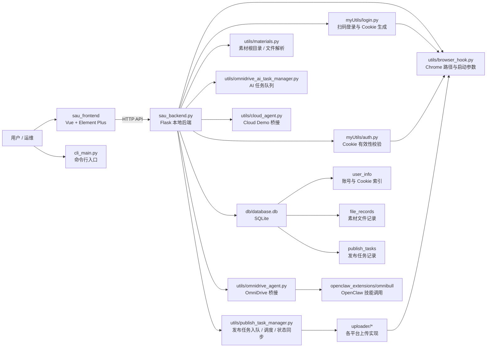
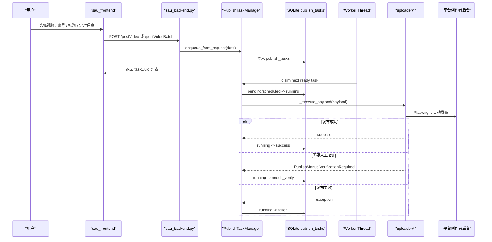
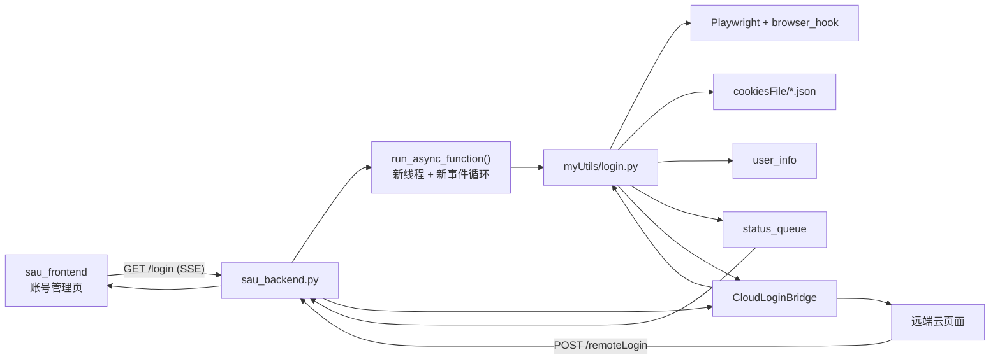
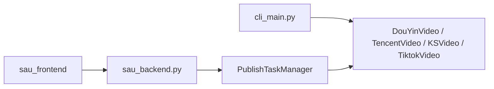

# SAU Runtime Architecture

这份文档补充 [docs/project_structure.md](./project_structure.md)，聚焦当前仓库里最重要、也是最容易继续开发的那条本地执行链路：

- `sau_frontend`
- `sau_backend.py`
- `myUtils`
- `utils`
- `uploader`
- `db`

目标是把“当前工程做到哪了”和“模块之间怎么连”固定下来，作为后续排查和重构的共同基线。

## 当前判断

- 当前最完整、最可信的主链路仍然是 `Flask + Vue + Playwright uploader + SQLite`。
- 仓库已经演化成多项目仓库，但 `social-auto-upload` 的本地执行器主线没有消失。
- 后端 `sau_backend.py` 目前承担了 API 层、任务调度入口、静态资源服务、登录桥接、云端桥接初始化等多种职责。
- `uploader` 目录里的平台实现更接近真实执行层；前端页面存在一些接口契约漂移，不能把页面行为直接等同于后端真实能力。

## 1. 总体模块关系图

## 2. 发布主链路

当前发布不是“前端直接调用 uploader”，而是统一经过后端入队，再由后台 worker 真正执行。

### 发布链路里各层分别负责什么

- `sau_frontend/src/views/PublishCenter.vue`
  - 负责收集视频、账号、标题、批量发布操作。
- `sau_backend.py`
  - 提供 `/postVideo`、`/postVideoBatch`、`/publishTasks`、`/publishTaskDetail`。
- `utils/publish_task_manager.py`
  - 负责参数归一化、账号和文件记录补齐、任务入库、worker 抢占、状态更新、截图归档。
- `uploader/douyin_uploader/main.py`
  - 抖音上传执行。
- `uploader/tencent_uploader/main.py`
  - 视频号上传执行。
- `uploader/ks_uploader/main.py`
  - 快手上传执行。

### 当前真实支持范围

- 在发布队列主链路里，当前明确接入的是：
  - `2` 视频号
  - `3` 抖音
  - `4` 快手
- 小红书、TikTok、Bilibili、百家号虽然存在 uploader 实现或示例，但并未完整接入当前 `PublishTaskManager` 的执行分发。

## 3. 登录与 Cookie 链路

登录链路分成两类：本地前端直连 SSE 登录、远端桥接登录。

### 登录链路说明

- `sau_backend.py:/login`
  - 建立 `status_queue`，启动线程调用 `run_async_function(type, id, status_queue)`，再把队列内容转成 SSE 输出。
- `run_async_function`
  - 按平台类型分发到：
  - `xiaohongshu_cookie_gen`
  - `get_tencent_cookie`
  - `douyin_cookie_gen`
  - `get_ks_cookie`
- `myUtils/login.py`
  - 负责真正的扫码页打开、二维码截图、状态推送、登录完成后保存 cookie 与账号记录。
- `myUtils/auth.py`
  - 负责后续“校验 Cookie 是否还有效”。

## 4. 运行时分层关系

从职责上看，现在的本地执行器大致可以分成 6 层：

1. 交互层
   - `sau_frontend`
   - `cli_main.py`
2. 接口层
   - `sau_backend.py`
3. 任务编排层
   - `utils/publish_task_manager.py`
   - `utils/omnidrive_ai_task_manager.py`
4. 平台能力层
   - `myUtils/login.py`
   - `myUtils/auth.py`
   - `uploader/*`
5. 基础设施层
   - `utils/browser_hook.py`
   - `utils/materials.py`
   - `utils/cloud_agent.py`
   - `utils/omnidrive_agent.py`
6. 持久化层
   - `db/database.db`

一个很重要的理解是：

- `sau_backend.py` 现在同时横跨了接口层和一部分编排层。
- `uploader/*` 是真正的平台执行层。
- `db` 不是“只给后台存数据”，它实际上也是发布状态机和账号索引的一部分。

## 5. CLI 与 Web 的关系

CLI 和 Web 不是同一条入口，但最终都会落到相似的平台执行器上。

### 关键区别

- CLI 直接调用 uploader，不经过 Flask 任务表。
- Web 入口会先写入 `publish_tasks`，再由 worker 执行。
- CLI 当前默认使用 `BASE_DIR/cookies`，而后端登录与账号管理主链路使用 `BASE_DIR/cookiesFile`。
- 这意味着：
  - CLI 更像直接执行工具。
  - Web 更像带任务管理和状态追踪的调度器。
  - CLI 和 Web 的账号资产目前不一定天然共享，联调时要先确认 Cookie 存储路径是否统一。

## 6. 当前开发里要特别记住的几个事实

### 6.1 前后端存在接口漂移

目前前端 API 定义与后端真实接口之间存在若干不一致，后续联调时必须逐项核对：

- `sau_frontend/src/api/account.js`
  - 登录 SSE URL 用的是 `platform` 和 `account` 参数。
- `sau_backend.py:/login`
  - 实际读取的是 `type` 和 `id` 参数。
- `sau_frontend/src/api/publish.js`
  - `getPublishTaskDetail` 用的是 `uuid` 参数。
- `sau_backend.py:/publishTaskDetail`
  - 实际支持的是 `id` 或 `taskUuid`。
- `sau_frontend/src/api/account.js`
  - `addAccount()` 调 `/account`。
- `sau_backend.py`
  - 当前并没有对应的 `/account` 路由。
- `sau_frontend/src/api/account.js`
  - Cookie 下载按 `id` 拼接。
- `sau_backend.py:/downloadCookie`
  - 当前读取的是 `filePath`。

### 6.2 后端是单文件总控

`sau_backend.py` 目前混合了这些职责：

- 本地 Web API
- SSE 登录
- 发布任务入口
- AI 任务入口
- Skill API
- 静态资源服务
- Cloud/OmniDrive agent 启动

这让它很好找入口，但也意味着：

- 新功能先加进去很快
- 真到中后期会越来越难拆、越来越难测

### 6.3 真实执行能力和仓库展示能力不是一回事

仓库里能看到很多平台目录，不代表当前调度主链路都已经接入。

后续开发要优先区分三种状态：

- 目录存在
- CLI 可调用
- Web 任务队列可稳定调用

## 7. 建议作为后续开发基线的理解

如果我们后面继续迭代这个工程，建议把理解统一成下面这句话：

> 当前系统的核心不是前端页面，也不是云端桥接，而是“本地 Flask 调度器 + SQLite 状态表 + uploader 平台执行器”。

基于这个判断，后续优先级建议是：

1. 先校正前后端 API 契约。
2. 再明确哪些平台已经进入统一发布队列。
3. 然后再考虑拆分 `sau_backend.py` 的职责边界。

## 8. 后续维护建议

后面如果我们做这些动作，请同步更新这份文档：

- 新平台进入 `PublishTaskManager` 主链路
- 登录 SSE 协议改动
- `sau_backend.py` 被拆分成 blueprint / service / worker
- OmniDrive / OpenClaw 调用链替代本地前端主入口
