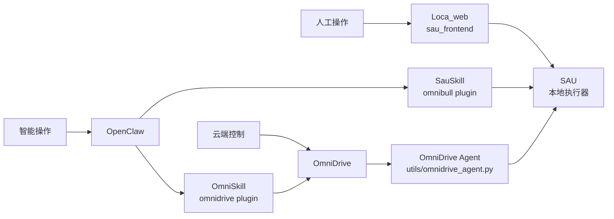

# System Management Baseline

这份文档基于仓库里的 [系统工作示意图.png](/Volumes/mud/project/github/social-auto-upload/系统工作示意图.png) 与当前代码现状，目标不是解释单个模块怎么实现，而是先把几个大模块之间的管理关系固定下来，作为后续迭代、拆分和联调的共同基线。

如果后面大家再讨论“这个功能应该放哪边”“这个数据到底谁说了算”“改一个点会影响哪些模块”，优先以这份文档为准。

## 1. 图中模块和仓库目录的对照

### 1.1 名称归一

- `SAU`
  - 指本地执行器本体，不只是一个 Flask 文件。
  - 当前对应：
    - `sau_backend.py`
    - `uploader/`
    - `myUtils/`
    - `utils/`
    - `db/`
- `Loca_web`
  - 指本地 Web 控制台。
  - 当前实际目录是：
    - `sau_frontend/`
  - README 里也把它称为 `LocaWeb / OmniBull / SAU` 本地前端。
- `OpenClaw`
  - 指本地智能代理和插件宿主。
  - 当前仓库里主要保存的是插件，而不是 OpenClaw 核心运行时：
    - `openclaw_extensions/omnibull/`
    - `openclaw_extensions/omnidrive/`
- `SauSkill`
  - 指 `OpenClaw -> SAU` 这一条本地技能调用链。
  - 当前主要落在：
    - `openclaw_extensions/omnibull/`
    - `sau_backend.py:/api/skill/*`
- `OmniDrive`
  - 指云控侧，不只是一个前端。
  - 当前仓库里的相关工程包括：
    - `omnidrive_cloud/`
    - `omnidrive_frontend/`
    - `OmniDriveAdmin/`
- `OmniSkill`
  - 图里是 `OmniDrive <-> OpenClaw` 之间的技能能力通道。
  - 当前主要落在：
    - `openclaw_extensions/omnidrive/`
    - `omnidrive_cloud` 的 `/api/v1/*`
    - `sau_backend.py:/api/skill/omnidrive/session`

### 1.2 一句话定位

- `Loca_web` 是本地人工操作台。
- `SAU` 是本地真实执行器。
- `OpenClaw` 是本地智能调度入口。
- `SauSkill` 是 OpenClaw 调用本地 SAU 的受控接口层。
- `OmniDrive` 是云端控制面和多设备管理面。
- `OmniSkill` 是 OpenClaw 调用云端 OmniDrive 能力的接口层。

## 2. 推荐采用的管理视角

后续工作里，建议把系统统一理解成下面这三层：

这里最关键的一点是：

- `SAU` 负责执行。
- `OmniDrive` 负责跨设备控制和云侧视图。
- `OpenClaw` 负责智能入口和工具编排。
- `Loca_web` 负责本机人工管理。

不要把 `Loca_web`、`OpenClaw`、`OmniDrive` 都当成“系统中枢”。
它们都是入口，但真正落地执行的平台发布、Cookie 校验、任务 worker、素材解析，仍然在本地 `SAU`。

## 3. 各模块的职责边界

### 3.1 SAU

`SAU` 是本地执行器，也是本地图里最接近“底座”的模块。

它负责：

- 本地账号 Cookie 的生成、校验、存储。
- 本地素材目录和素材文件读取。
- 本地发布任务入队、调度、执行、截图归档。
- 调用 `uploader/*` 完成各平台浏览器自动化发布。
- 对外暴露本地 Web API 和 Skill API。
- 在启用时，把本地状态同步给 `OmniDrive`。

它不应该负责：

- 承担完整的云端用户体系。
- 承担云端技能资产的主存储。
- 直接变成 OpenClaw 的业务编排器。

### 3.2 Loca_web

`Loca_web` 当前就是 `sau_frontend`，它是给人用的本地管理台。

它负责：

- 展示本地账号、素材、发布任务、系统状态。
- 发起本地登录、发布、查询等请求。
- 作为调试和人工补救入口。

它不应该负责：

- 直接操作数据库。
- 绕过后端直接定义执行逻辑。
- 作为云端数据主视图。

### 3.3 OpenClaw

`OpenClaw` 是本地智能入口，但不是平台执行器。

它负责：

- 把自然语言请求编排成插件调用。
- 通过 `SauSkill` 使用本地 SAU 能力。
- 通过 `OmniSkill` 使用云端 OmniDrive AI 能力。
- 在一个会话里把“查账号、查素材、发任务、查任务结果”串起来。

它不应该负责：

- 直接访问 SAU 的数据库或本地文件。
- 直接实现平台上传逻辑。
- 直接承担 OmniDrive 的状态同步逻辑。

### 3.4 SauSkill

`SauSkill` 是 OpenClaw 调本地 SAU 的边界层，不是新的业务中枢。

它负责：

- 把 OpenClaw 的工具调用参数映射成 SAU `/api/skill/*` 请求。
- 做少量参数归一化和鉴权透传。
- 暴露本地状态、账号、素材、发布任务的受控访问方式。

它不应该负责：

- 复制一份 SAU 的业务规则。
- 存储本地任务或账号状态。
- 在插件侧单独维护一套平台枚举和执行分支。

### 3.5 OmniDrive

`OmniDrive` 是云端控制面，不是浏览器自动化执行器。

它负责：

- 管理设备绑定、会话、账号、技能、云端任务。
- 保存云端技能包和知识文件。
- 接收本地节点汇报的执行结果和设备状态。
- 向本地节点下发任务、技能、素材引用和策略。

它不应该负责：

- 直接控制本地浏览器页面。
- 假设自己拥有本地 Cookie 文件的真实主存储。
- 取代 SAU 的本地 worker 和 Playwright 执行层。

### 3.6 OmniSkill

`OmniSkill` 是 OpenClaw 调云端 OmniDrive 的边界层。

它负责：

- 提供聊天、作图、视频等云端 AI 能力。
- 使用本机 SAU 暴露的设备会话信息，确定当前可用的 OmniDrive 设备上下文。
- 帮 OpenClaw 访问 OmniDrive 的用户态 API。

它不应该负责：

- 自己维护设备绑定真相。
- 绕过 OmniDrive API 直接处理云端业务数据。
- 直接承担本地发布执行。

## 4. 各类资源到底谁管理

后续最容易混乱的是“任务、账号、知识文件、素材、结果”这些资源到底谁说了算。

建议先按下面这张表统一理解。

| 资源 | 主管理者 | 本地缓存/执行方 | 备注 |
| --- | --- | --- | --- |
| 本地 Cookie 文件 | SAU | SAU | 真实文件在 `cookiesFile/`，云端不应视为主存储 |
| 本地账号运行状态 | SAU | SAU | `user_info` 和 `check_cookie()` 是本地真相 |
| 云端账号元数据 | OmniDrive | SAU 可同步镜像 | 若云端要展示，建议只存摘要，不替代本地 Cookie |
| 本地素材文件 | SAU | SAU | 真实文件与目录权限由本机控制 |
| 云端技能包 / 产品知识文件 | OmniDrive | SAU 缓存到 `omnidriveSync/skills` | 云端是主源，本地是消费端 |
| 本地发布任务（本地 UI 发起） | SAU | SAU | 先入本地 `publish_tasks`，再决定是否同步云端 |
| 云端发布任务（云端发起） | OmniDrive | SAU 拉取并执行 | 云端是任务主记录，本地持有执行镜像和租约 |
| AI 任务 | OmniDrive 为主 | SAU 可镜像结果 | 本地已有 `omnidrive_ai_task_manager.py` 做同步桥接 |
| 执行截图 / 验证产物 | SAU | SAU，必要时上报 OmniDrive | 当前本地目录为 `taskArtifacts/publish_verify/` |
| 设备绑定与设备会话 | OmniDrive | SAU / OpenClaw 读取 | 本机通过 agent/status/session 获取 |

## 5. 图中箭头对应的“管理关系”

### 5.1 `Loca_web -> SAU`

这条线是“本地人工管理线”。

应该承载：

- 本地任务增删改查。
- 本地账号增删改查。
- 本地素材和知识文件的查看、上传、删除。
- 系统状态查看和人工重试。

不建议让这条线直接承载：

- 云端全局设备调度。
- 云端 AI 任务主视图。
- 绕过后端的本地执行逻辑。

### 5.2 `OpenClaw -> SauSkill -> SAU`

这条线是“本地智能操作线”。

应该承载：

- 媒体发布。
- 定时发布任务创建。
- 发布任务查状态。
- 账号列表、素材目录读取。

这条线最重要的约束是：

- OpenClaw 只能通过 `SauSkill` 访问 SAU。
- `SauSkill` 只能通过 `/api/skill/*` 访问 SAU。
- 不要让插件直接碰本地 sqlite、cookies、materials 目录。

### 5.3 `OpenClaw -> OmniSkill -> OmniDrive`

这条线是“云端智能能力线”。

应该承载：

- 云端 chat/image/video。
- 云端 job 查询。
- 云端账号态登录和 token 获取。

这条线目前还依赖一个现实条件：

- `OmniSkill` 会优先从本地 SAU 读设备会话，再把云端 AI 能力限定在当前已绑定设备上。

所以它不是完全脱离 SAU 的独立链路，而是“云能力优先，但仍受本机设备绑定约束”。

### 5.4 `OmniDrive -> SAU`

这条线是“云控下发线”。

按图里的目标，它应该管理：

- 平台账号元数据增删改查。
- 任务增删改查。
- 产品知识文件增删改查。

但按当前代码现状，需要更准确地理解成：

- 云端可以下发任务、技能包、素材引用、设备绑定信息。
- 本地仍然保留 Cookie 文件、实际执行状态、worker 生命周期这些运行时真相。
- 所以这是“控制面管理”，不是“执行面接管”。

### 5.5 `SAU -> OmniDrive`

这条线是“本地执行汇报线”。

应该承载：

- 任务执行结果。
- 账号同步信息。
- 设备状态、素材根目录、技能同步状态。
- 人工验证结果和执行产物摘要。

这条线不应该承载：

- 把本地所有临时状态和原始文件都无差别推上云。
- 让云端直接依赖本地内部表结构。

## 6. 后续开发时建议遵守的边界规则

### 6.1 谁都不要绕过自己的边界层

- 人工入口走 `Loca_web -> SAU API`。
- OpenClaw 本地能力走 `OpenClaw -> SauSkill -> /api/skill/*`。
- OpenClaw 云能力走 `OpenClaw -> OmniSkill -> OmniDrive API`。
- 云控下发走 `OmniDrive -> OmniDrive agent -> SAU`。

### 6.2 SAU 是执行真相，不是全局真相

这句话很重要：

- 本地执行、Cookie、worker、截图归档这些，真相在 SAU。
- 多设备任务编排、技能包版本、云端用户身份这些，真相在 OmniDrive。

### 6.3 OpenClaw 是入口，不是持久化中心

插件可以封装调用体验，但不要把业务规则复制进插件里。

否则后面会出现：

- SAU 改了参数，插件忘了改。
- OmniDrive 改了 contract，插件又维护了一套旧逻辑。

### 6.4 `Loca_web` 和 `OmniDrive` 的职责要刻意错开

建议这样分：

- `Loca_web`
  - 面向“当前这台机器”的即时操作和人工补救。
- `OmniDrive`
  - 面向“跨设备”的统一控制和资产管理。

如果两边都做同一套任务和账号管理页面，就会在后续长期维护里不断打架。

## 7. 变更影响面速查

后续做需求时，可以用这张表先判断要动哪些模块。

| 变更类型 | 至少会影响的模块 |
| --- | --- |
| 新增一个发布平台 | `uploader/*`、`utils/publish_task_manager.py`、`sau_backend.py`、`sau_frontend`、`openclaw_extensions/omnibull`，若云控要下发还要补 `OmniDrive` contract |
| 调整本地账号模型 | `myUtils/login.py`、`myUtils/auth.py`、`db`、`sau_backend.py`、`sau_frontend`、`SauSkill` |
| 调整云端技能包模型 | `omnidrive_cloud`、`utils/omnidrive_agent.py`、`openclaw_extensions/omnidrive`，必要时补 `sau_backend.py:/api/skill/omnidrive/*` |
| 调整本地任务状态机 | `utils/publish_task_manager.py`、`sau_backend.py`、`sau_frontend`、`SauSkill`、`OmniDrive agent` 同步逻辑 |
| 调整素材目录或素材引用协议 | `utils/materials.py`、`sau_backend.py`、`sau_frontend`、`SauSkill`、必要时 `OmniDrive` 素材镜像接口 |

## 8. 当前最适合当作后续工作起点的结论

为了后面好推进，建议我们先统一三句话：

1. `SAU` 是本地执行器，不是单纯后端页面项目。
2. `OmniDrive` 是控制面，`OpenClaw` 是智能入口，`Loca_web` 是人工入口。
3. 资源的“主管理者”和“执行者”可以不是同一个模块，但边界必须固定。

如果后面要继续细化，我建议优先再补两份东西：

- 一份“资源主权表”
  - 把账号、素材、技能、任务、结果分别拆到字段级别，明确谁是主写方、谁是镜像方。
- 一份“链路契约表”
  - 把 `Loca_web -> SAU`、`SauSkill -> SAU`、`OmniSkill -> OmniDrive`、`OmniDrive agent -> SAU` 的接口面分别列出来。
